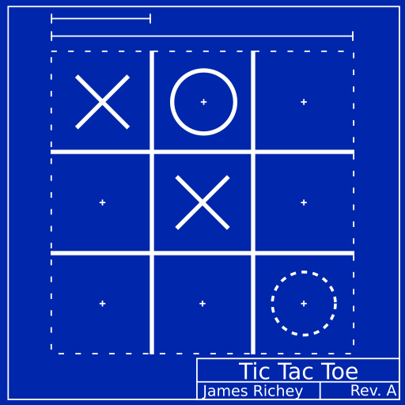

# FossXO



FossXO is a unique take on the classic game of tic-tac-toe.

* Over 20 beautiful environments including classic paper-and-pencil, modern
  computer screens, and futuristic cyber punk.
* Amazing soundtrack for a fully immersive experience.
* Challenging AI that is ready to counter any strategy.
* Battle your friends with local multiplayer.
* Try speedrun mode for an additional challenge.
* Free, open-source, and no annoying advertisements.


## Build from Source
FossXO is developed using the [Rust programming language](https://www.rust-lang.org/).
Install Rust on your system then do the following:


```bash
# Install the required build tools.
cargo install cargo-make

# Clone the repository.
git clone https://github.com/fossxo/fossxo.git
cd fossxo

# Build and run the game.
cargo make
```

Note: it might take a while to build game the first time it is run.


## License
FossXO is free and open-source software distributed under the [MIT License](LICENSE-MIT) and the [Apache License 2.0](LICENSE-APACHE).
