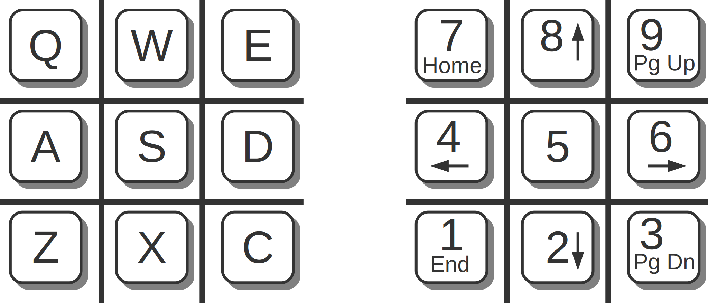

# Keyboard / Mouse Controls
The game can be fully played with either a mouse or keyboard.

## Mouse
Left click to select free squares and press menu buttons.

## Keyboard
The game supports using the keyboard to select squares. Use either
The **numpad** keys or the **QWE** keys as shown below. 

Other useful short keys are:

* **ESC** opens the game menu.
* Use **Enter** or **Space** at the end of the game to start the next game.
